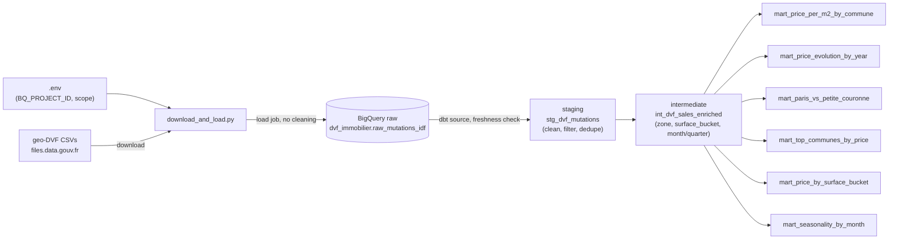

# BigQuery SQL – Paris Real Estate Analysis (DVF)

## Why this project?

Practice project to work with a real, large, publicly available French dataset (DVF —
property sales registered by the tax authority) end-to-end: extract/load, model with
dbt, test, and answer concrete business questions about the Paris real estate market.

## What this project does

SQL analyses of the **French real estate market** using the official open **DVF**
dataset (*Demandes de Valeurs Foncières*): every property sale registered by the French
tax authority (DGFiP).

Scope: **Paris + petite couronne** (departments 75, 92, 93, 94), rolling window
of the last 5 completed years (computed automatically at run time — see
`default_years()` in `scripts/download_and_load.py`).

> ✅ **Project status:** both the Python extract-load step
> (`scripts/download_and_load.py`) and the dbt transformation layer
> (`dbt/`) are functional. The dbt layer now has three model layers
> (staging → intermediate → marts), reusable macros, `dbt_utils`
> generic tests, source freshness checks, dev/prod schema separation,
> and six marts.

## Stack

`BigQuery` `SQL` `Python` `pandas` `dbt` `python-dotenv` `DVF Open Data`

## Architecture

The project follows a standard **EL + T** split: Python only extracts and
loads the raw data; all cleaning, testing, and business logic lives in
**dbt**, as SQL models with declared tests. This keeps a full copy of the
untouched raw data in BigQuery at all times, so the transformation logic
can be changed or fixed without re-downloading anything.



| Layer | Tool | Responsibility | Status |
|---|---|---|---|
| Extract + Load | `scripts/download_and_load.py` (Python) | Download geo-DVF CSVs, load them as-is into a raw BigQuery table | ✅ Working |
| Staging | `dbt/models/staging/` | Clean, rename, filter, and deduplicate the raw data | ✅ Working |
| Intermediate | `dbt/models/intermediate/` | Business enrichment shared by marts (zone, surface bucket, month/quarter) | ✅ Working |
| Test | `dbt/models/**/*.yml` + `dbt/tests/` + `dbt_utils` generic tests | not_null, accepted_values, unique combinations, source freshness, custom regression tests | ✅ Working |
| Analyze | `dbt/models/marts/` | 6 aggregated tables answering business questions | ✅ Working |

## Data source

| | |
|---|---|
| Dataset | Demandes de Valeurs Foncières géolocalisées (geo-DVF) |
| Publisher | Etalab / DGFiP |
| Files | `https://files.data.gouv.fr/geo-dvf/latest/csv/{year}/departements/{dept}.csv.gz` |
| License | Licence Ouverte / Open Licence (Etalab) |
| Coverage | All French property sales, updated ~twice a year |

Each row is one property mutation: sale price (`valeur_fonciere`), property
type (`type_local`), built area (`surface_reelle_bati`), rooms, address,
commune, date, and geolocation.

## Key columns (raw data dictionary)

| Column | Type | Description |
|--------|------|-------------|
| `date_mutation` | DATE | Sale date (ISO-8601) |
| `nature_mutation` | STRING | Type of transaction (e.g. *Vente*) |
| `valeur_fonciere` | FLOAT | Sale price in euros |
| `type_local` | STRING | Property type (*Appartement*, *Maison*, *Dépendance*, *Local...*) |
| `surface_reelle_bati` | FLOAT | Built area in m² |
| `nombre_pieces_principales` | INT | Number of main rooms |
| `code_postal` | STRING | Postal code (kept as text to preserve format) |
| `nom_commune` | STRING | Commune name |
| `code_departement` | STRING | Department code (75, 92, 93, 94) |
| `longitude` / `latitude` | FLOAT | Parcel geolocation (WGS-84) |

The raw table keeps all ~40 geo-DVF columns as loaded by
`scripts/download_and_load.py`. Filtering to residential sales only
(`nature_mutation = 'Vente'`, `type_local` in *Appartement* / *Maison*,
valid price and surface) happens in `dbt/models/staging/stg_dvf_mutations.sql`.

## Data quality tests (dbt)

| Test | Type | What it catches |
|---|---|---|
| `not_null` on key columns | generic | Missing mutation id, date, price, surface |
| `accepted_values` on `property_type` | generic | Unexpected property categories |
| `accepted_values` on `department_code` / `zone` / `surface_bucket` | generic | Sales outside scope, unexpected category |
| `dbt_utils.unique_combination_of_columns` | generic (dbt_utils) | Duplicate rows in staging, intermediate, and each mart's grain |
| Source freshness on `dvf_raw.raw_mutations_idf` | generic | Raw source not refreshed recently (see caveat in `_sources.yml`) |
| `assert_positive_price_and_surface` | singular | Regression on the price/surface filter |
| `assert_no_duplicate_mutations` | singular | Regression on the deduplication logic |

## Analyses (dbt marts)

- `mart_price_per_m2_by_commune` — average / median price per m² by commune and property type
- `mart_price_evolution_by_year` — year-over-year price trend by department
- `mart_paris_vs_petite_couronne` — Paris vs petite couronne comparison
- `mart_top_communes_by_price` — communes ranked by price and by sales volume, within their department
- `mart_price_by_surface_bucket` — price per m² by size category (studio/T2/T3/T4/T5+), zone, and property type
- `mart_seasonality_by_month` — sales volume and price by calendar month, to spot seasonal patterns

## Getting started

### 1. Extract + Load (Python)

```bash
pip install -r scripts/requirements.txt
gcloud auth application-default login
cp .env.example .env
# edit .env and set BQ_PROJECT_ID=your-sandbox-project-id
python scripts/download_and_load.py
```

This downloads the CSVs and loads them, unmodified, into
`dvf_immobilier.raw_mutations_idf`. No filtering happens here on purpose —
that's dbt's job.

**Configuration** lives in `.env` (copied from `.env.example`, the only one
committed to git). By default, `DVF_YEARS` is left unset and the script
computes the last 5 completed years automatically (geo-DVF is a rolling
window, so hardcoding years would go stale). Override scope via
`DVF_DEPARTMENTS` / `DVF_YEARS`, e.g.:
```
DVF_DEPARTMENTS=75    # Paris only
DVF_YEARS=2024        # a single year, for an incremental/manual run
```

> If you prefer not to use a `.env` file, regular shell `export` still
> works — real environment variables always take priority over `.env`.

### 2. Transform + Test (dbt)

```bash
python -m venv .venv-dbt && source .venv-dbt/bin/activate  # separate venv recommended
pip install -r dbt/requirements.txt
mkdir -p ~/.dbt
cp dbt/profiles.yml.example ~/.dbt/profiles.yml
# edit ~/.dbt/profiles.yml: set project to your BQ_PROJECT_ID
cd dbt
dbt deps    # installs dbt_utils (declared in packages.yml)
dbt debug   # checks the BigQuery connection
dbt run     # builds staging + intermediate + the 6 marts
dbt test    # runs all schema + singular tests
dbt source freshness  # checks how stale the raw source is
dbt docs generate && dbt docs serve  # browsable docs site
```

By default (`target: dev` in `profiles.yml.example`), builds land in
`dev_staging` / `dev_intermediate` / `dev_marts` — isolated from
production. Run `dbt run --target prod` to build into the real
`staging` / `intermediate` / `marts` schemas (see
`macros/generate_schema_name.sql`).

dbt authenticates with the same `gcloud auth application-default login`
credentials used by the Python script (`method: oauth` in
`profiles.yml.example`) — no service account key needed, and it works with
BigQuery Sandbox.

### Quick sanity check

```bash
bq query --use_legacy_sql=false \
  'SELECT department_code, COUNT(*) AS n
   FROM `your-project-id.dvf_immobilier_marts.mart_price_per_m2_by_commune`
   GROUP BY 1 ORDER BY 1'
```

> DVF files download into `data/` and are **not** committed to git (see
> `.gitignore`). Re-running the Python script skips files already present.

## Project structure

```
bigquery-real-estate-dvf-paris/
├── .env.example                    → Config template (copy to .env, never committed)
├── scripts/
│   ├── download_and_load.py        → Extract + Load: download geo-DVF, load raw table
│   └── requirements.txt            → Python dependencies (pandas, requests, google-cloud-bigquery...)
├── data/                           → Downloaded DVF files (git-ignored)
└── dbt/
    ├── dbt_project.yml             → dbt project config (staging/intermediate/marts schemas)
    ├── packages.yml                → dbt_utils dependency (run `dbt deps`)
    ├── profiles.yml.example        → Connection template, dev + prod targets (copy to ~/.dbt/profiles.yml)
    ├── requirements.txt            → dbt-core + dbt-bigquery
    ├── macros/
    │   ├── generate_schema_name.sql → dev_* schema prefix for the "dev" target, none for "prod"
    │   ├── zone.sql                 → dvf_zone(): Paris vs Petite couronne CASE expression
    │   └── surface_bucket.sql       → dvf_surface_bucket(): studio/T2/T3/T4/T5+ CASE expression
    ├── models/
    │   ├── docs.md                  → Shared  blocks (project overview + model descriptions)
    │   ├── staging/
    │   │   ├── _sources.yml         → Raw BigQuery table as a dbt source, with freshness check
    │   │   ├── stg_dvf_mutations.sql → Cleaning model (filter, rename, dedupe)
    │   │   └── _stg_dvf_mutations.yml → Column tests + dbt_utils unique_combination_of_columns
    │   ├── intermediate/
    │   │   ├── int_dvf_sales_enriched.sql → Adds zone, surface_bucket, sale_month, sale_quarter
    │   │   └── _int_dvf_sales_enriched.yml → Column-level tests
    │   └── marts/
    │       ├── mart_price_per_m2_by_commune.sql
    │       ├── mart_price_evolution_by_year.sql
    │       ├── mart_paris_vs_petite_couronne.sql
    │       ├── mart_top_communes_by_price.sql       → Communes ranked by price/volume within department
    │       ├── mart_price_by_surface_bucket.sql     → Price by zone × property type × surface bucket
    │       ├── mart_seasonality_by_month.sql        → Sales volume/price seasonality by calendar month
    │       └── _marts.yml          → Column-level tests for all 6 marts
    └── tests/                      → Singular (custom SQL) regression tests
        ├── assert_positive_price_and_surface.sql
        └── assert_no_duplicate_mutations.sql
```

## Roadmap

See open items in the repo's GitHub issues.

## Author

**Lisa Momas** – Digital Analytics & Data
[LinkedIn](https://www.linkedin.com/in/lisa-momas)
